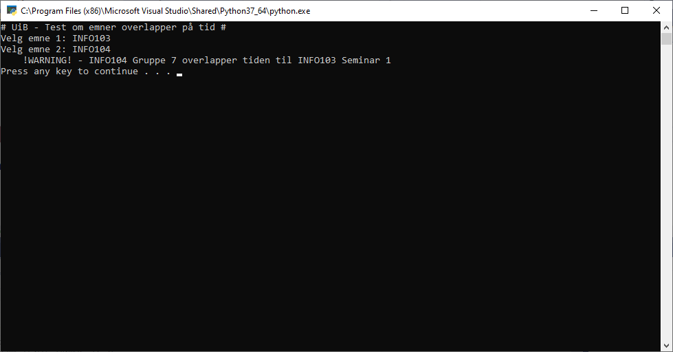

# UiB Schedule Tester

***Note:*** This is not an official program for UiB. And need no login.

This program lets you check if the times you need to be at UiB overlap on different topics.

Data is retrieved from tp.uio.no and mitt.uib.no (by entering uniq calendars url)

***The program does the following:***
- Retrieves data from source with filter set from user (topics).
	- Can retrieve data from tp.uio.no/uib/timeplan by entering subject code (emne kode).
	- Can retrieve data from your calendar from my UiB and include this in the dataset to check overlap
- Parses data from .ics calendar
- Create dataset of data.
- Checks the overlap of dates in different groups.
- Gives user an overview of something overlap.

